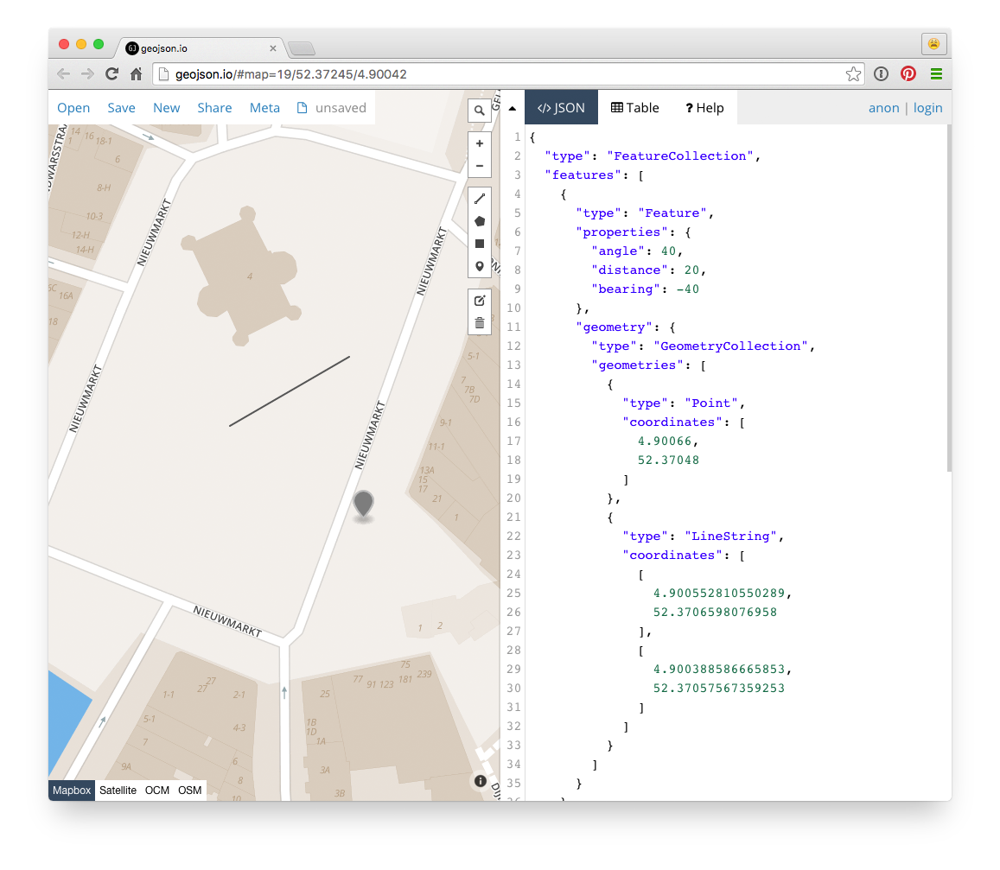

# field-of-view

__field-of-view__ is a JavaScript library to create photo [fields of view](https://en.wikipedia.org/wiki/Field_of_view) GeoJSON geometries. field-of-view can be used in tools for [photo geotagging](https://en.wikipedia.org/wiki/Geotagging), for example:

- [Leaflet.GeotagPhoto](https://github.com/nypl-spacetime/Leaflet.GeotagPhoto) - Leaflet plugin for photo geotagging
- [Surveyor](https://github.com/nypl-spacetime/surveyor) - web application for crowdsourced image geotagging
- [Street View, Then & Now: New York City's Fifth Avenue](http://publicdomain.nypl.org/fifth-avenue/)


field-of-view is developed for The New York Public Library's [NYC Space/Time Directory](http://spacetime.nypl.org/).

## Input

- `Point`: camera location
- `LineString` with two points: field of view
- `GeometryCollection` with two `Point` geometries: camera and target locations
- `GeometryCollection` with three `Point` geometries: camera and target locations, and a point to determine the angle of the field-of-view

See the [API section](#api) for more details.

## Output

- [`GeometryCollection`](http://geojson.org/geojson-spec.html#geometry-collection) with two geometries:
  1. `Point`: location of camera
  2. `LineString`: field of view

Example:

```json
{
  "type": "Feature",
  "properties": {
    "angle": 45,
    "bearing": -87.81893783,
    "distance": 690.3534921
  },
  "geometry": {
    "type": "GeometryCollection",
    "geometries": [
      {
        "type": "Point",
        "coordinates": [
          4.918044805,
          52.379463370
        ]
      },
      {
        "type": "LineString",
        "coordinates": [
          [
            4.908044296,
            52.38226812
          ],
          [
            4.90772491,
            52.37713015
          ]
        ]
      }
    ]
  }
}
```




## Installation

Using Node.js:

    npm install field-of-view

Browser:

```html
<script src="https://unpkg.com/field-of-view"></script>
```

## Usage

Node.js example:

```js
const fieldOfView = require('field-of-view')

const feature = {
  type: 'Feature',
  properties: {
    angle: 50
  },
  geometry: {
    type: 'LineString',
    coordinates: [
      [
        4.90028,
        52.37249
      ],
      [
        4.90065,
        52.37262
      ]
    ]
  }
}

const fov = fieldOfView.fromFeature(feature)

console.log(fov, null, 2)
```

## API

### `fieldOfView.fromFeature (feature, options)`

Converts `feature` to Field of View geometry; `feature` must be one of the following GeoJSON objects:

- `Point`
  - Point is camera location
  - `properties.bearing` should be specified
  - `properties.distance` should be specified
- `LineString` with two points; this is the field of view of the photo
- `GeometryCollection` with two `Point` geometries
  1. Point location of the camera
  2. Point location of the camera's target
- `GeometryCollection` with three `Point` geometries
  1. Point location of the camera
  2. Point location of the camera's target
  3. Point determining the angle of the field-of-view

__In all cases except the last__, features must specify the camera's [angle of view](https://en.wikipedia.org/wiki/Angle_of_view) by setting `properties.angle`, or by passing the `angle` as an option to the `field-of-view` module:

```js
const options = {
  angle: 45
}
```

`fieldOfView.fromFeature` returns a single feature with a `GeometryCollection` containing two geometries, the location of the camera and the field of view. The feature's `properties` contains three values:

  - `angle`: angle of view of camera (0 - 180)
  - `bearing`: bearing of camera (0 - 360)
  - `distance`: distance between camera and target, in meters

See the [Output section](#output) for an example.

## See also

- http://spacetime.nypl.org/
- https://github.com/nypl-spacetime/Leaflet.GeotagPhoto
- https://github.com/nypl-spacetime/surveyor
- http://turfjs.org/
- http://publicdomain.nypl.org/fifth-avenue/